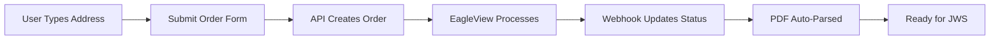

# 🦅 EagleView API Integration Guide

## Overview

This guide walks you through setting up the EagleView API integration to allow users to order roof measurement reports directly from your application.

## 🔧 Setup Steps

### Step 1: Create Your EagleView Application

When creating your application in the EagleView Developer Portal:

1. **Select API Collections:**
   - ✅ **User Authorization** (Required)
   - ✅ **Measurement Orders** (Required)
   - ✅ **System Integration** (Required for webhooks)
   - ✅ **Property Data** (Optional but recommended)
   - ❌ **TrueDesign™** (Not needed)
   - ❌ **SolarReady™** (Not needed)

2. **Configure Application Details:**
   - Application Name: "3MG Retail Estimator"
   - Description: "Direct integration for roof measurement orders"
   - Webhook URL: `https://xtdyirvhfyxmpexvjjcb.supabase.co/functions/v1/eagleview-webhook`

### Step 2: Get Your API Credentials

After creating the application, you'll receive:
- **API Key**
- **Client ID**
- **Client Secret**

Save these securely!

### Step 3: Add Environment Variables

Add these to your `.env` file:

```bash
# EagleView API Credentials
VITE_EAGLEVIEW_API_KEY=your_api_key_here
VITE_EAGLEVIEW_CLIENT_ID=your_client_id_here
VITE_EAGLEVIEW_CLIENT_SECRET=your_client_secret_here
VITE_EAGLEVIEW_WEBHOOK_URL=https://xtdyirvhfyxmpexvjjcb.supabase.co/functions/v1/eagleview-webhook
```

### Step 4: Deploy Database Migration

Run the migration to create the EagleView orders table:

```bash
npx supabase db push
```

### Step 5: Deploy the Webhook Function

Deploy the Edge Function that handles EagleView webhooks:

```bash
npx supabase functions deploy eagleview-webhook
```

### Step 6: Update Database Types

Regenerate TypeScript types to include the new table:

```bash
npx supabase gen types typescript --local > src/integrations/supabase/database.types.ts
```

## 🎯 How It Works

### 1. **User Flow:**



### 2. **Order Process:**

1. **User enters address** in the EagleView order form
2. **API creates order** with EagleView
3. **Order saved** to Supabase with pending status
4. **EagleView processes** the order (usually 1-2 business days)
5. **Webhook receives** completion notification
6. **PDF downloaded** and auto-parsed
7. **Measurements ready** for estimate creation

### 3. **Status Flow:**

- `pending` → Order submitted
- `processing` → EagleView is working on it
- `completed` → Report ready, PDF parsed
- `failed` → Something went wrong

## 📱 Integration Points

### 1. **Add to Estimates Page:**

```tsx
import { EagleViewOrderForm } from '@/components/estimates/eagleview/EagleViewOrderForm';

// In your Estimates component
<Tabs>
  <TabsList>
    <TabsTrigger value="upload">Upload PDF</TabsTrigger>
    <TabsTrigger value="order">Order EagleView</TabsTrigger>
  </TabsList>
  
  <TabsContent value="upload">
    <PdfUploader />
  </TabsContent>
  
  <TabsContent value="order">
    <EagleViewOrderForm 
      estimateId={currentEstimateId}
      onOrderComplete={(orderId) => {
        // Handle order completion
      }}
    />
  </TabsContent>
</Tabs>
```

### 2. **Check Order Status:**

```tsx
// Check status of an order
const checkOrderStatus = async (orderId: string) => {
  const { data, error } = await supabase
    .from('eagleview_orders')
    .select('*')
    .eq('order_id', orderId)
    .single();
    
  if (data?.status === 'completed') {
    // Report is ready!
  }
};
```

## 🔒 Security & Permissions

### RLS Policies:
- **Users** can view/create their own orders
- **Territory Managers** can view orders in their territory
- **Admins** can view all orders

### API Security:
- Credentials stored in environment variables
- OAuth2 authentication for API calls
- Webhook signature verification (when available)

## 💰 Pricing Considerations

EagleView charges per report. Consider:
- Basic Report: ~$20-30
- Premium Report: ~$35-50
- Rush Orders: +50% fee

You may want to:
1. Pass cost to customer
2. Include in estimate markup
3. Set limits per user/month

## 🚀 Testing

1. **Test Order Creation:**
   ```bash
   # Use a known address for testing
   123 Main St, Tampa, FL 33601
   ```

2. **Test Webhook:**
   ```bash
   curl -X POST https://your-webhook-url \
     -H "Content-Type: application/json" \
     -d '{
       "orderId": "test-123",
       "status": "completed",
       "reportUrl": "https://example.com/report.pdf"
     }'
   ```

## 📊 Monitoring

Monitor your integration:
1. Check Supabase logs for webhook activity
2. Monitor the `eagleview_orders` table
3. Set up alerts for failed orders

## 🆘 Troubleshooting

### Common Issues:

1. **401 Unauthorized**
   - Check API credentials
   - Verify OAuth token generation

2. **Webhook not firing**
   - Verify webhook URL in EagleView dashboard
   - Check Edge Function logs

3. **PDF not parsing**
   - Ensure report_url is accessible
   - Check PDF parsing logs

## 📞 Support

- **EagleView Support**: support@eagleview.com
- **API Documentation**: https://developer.eagleview.com
- **Your App Logs**: Supabase Dashboard → Functions → Logs

---

## Next Steps

1. ✅ Complete EagleView app creation
2. ✅ Add environment variables
3. ✅ Deploy database migration
4. ✅ Deploy webhook function
5. ✅ Test with a real address
6. ✅ Monitor first orders

Once configured, users can order EagleView reports directly from your app, bypassing AccuLynx entirely! 